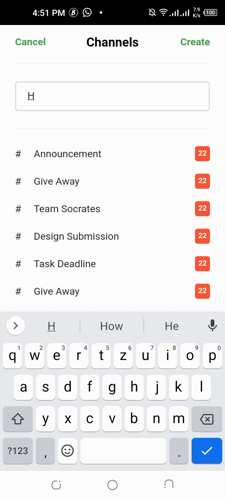

# Zuri Chat 
  ## Overview 
  This is the **Zuri Chat** Andriod APP project Repository handled by **_TEAM SOCRATES_** witten with pure [Flutter](https://flutter.dev/).
  
  NB: Always contact Team leads before attempting any task **Except** assigned too.
  
  - _All Team member must adhere to the follow procedure while working on this project._
  - _Make sure you understand the project Architecture before proceeding with any tasks_
  
  App Record
  
  
  ## Project Description
  ZuriChat is a mobile application clone of the already existing slack application with more features like music room, chess room, meeting room etc etc.

  - Music room: A room for shared playlist where users can add, play and share songs amongst themselves.

  - Meeting rooms A room where meetings can take place amongst members. The meeting room also has a whiteboard where designs and texts to better visualize points of discussion and for better understanding.

  - Documentation room: A room that has the company's documentation, files and folders and so on.

  - Avatar room: A room where you can design or choose an avatar that best describes your expression.

   ## Design 
   The figma design that will be implemented for this project can be found [here](https://www.figma.com/file/a9aoc4xi2gjPupffXXRdXS/Team-Socrates?node-id=5461%3A22089) 

   ## Hosted App Link
[Here](https://appetize.io/app/01maqa9k0b50p27nvh22dca3d0)  is the link to the app hosted on appetize
 
  **i. Naming Convention**

|Naming Convention|Effective Style|Example|   
|-----------------|---------------|-------|
|Classes, enum types,typedefs,and type parameters,etensions|PascalCase|An example is HomeScreen|
|Libraries, packages, directories, and source files, import prefixes|snake_case|An example is home_screen|
|Class members, top-level definitions, variables, parameters, and named parameters, constants|camelCase|An example is verifiedUser|

   
   **ii. Style Rule**
   * Always declare return types in your methods.
   * Put required named parameters first.
   * Always require non-null named parameters (@required).
   * Indent your code where appropriate `(e.g Use two-space indentation.)`
       Click [Here](https://docs.google.com/document/d/1kgVwGVgKrMXKgxuMowgqsBkFXsJdli-4Zl-oP_NZFoI/edit "Github home") to know more
   
   
   
   ## Contribution Guide
  **_Steps to collaborate on the Repository for Team Members._**
  ### Forking and Cloning Repo
  * Fork the project.  
  * Click on the "Code" button on the Repo page.
  * Copy the URL for the forked Repo "https://github.com/your-github-username/zc_app.git"
  * Open your Code Editor and  run `git clone` "https://github.com/your-github-username/zc_app.git"
  
### _Add "Remote To" and "Pull From" Upstream_
 - Add a Remote to Upstream to your Repo:
   Using the command : `git remote add upstream` ` "https://github.com/Valenteeena/zc_plugin_channels" ` 
 - Pull from upstream to download all changes in the project using `git pull upstream develop`

### Complete assigned Task/ Issue
  - Open the project in your IDE or Code Editor.
  - Complete your assigned task.

### Create and Commit Changes to a New Branch
When your task is completed
  * Create a new branch with your task name e.g "feat- UserSignUP". 
  * run: `git checkout -b feat/yourTask`
**Push to github;**
  * `git add .`
  * `git commit -m "feat: Inplemented yourTask"`
  
### Push New Branch to "Origin" Repository
 - To make sure there are no conflict, Pull from upstream using `git pull upstream develop`
 - Push your branch changes to the Repo using `git push origin "feat/yourTask"` note how it end with a branch.

### Creating Pull Request
**When making a PR, your PR is expected to have the following comments"**
  - What is the task/issue completed?
  - What does the PR actually do?
  - How can the PR be manually tested?
  - Screenshots(of your implementation - A mobile screen or an APi payload). 

### Directory stucture
  You can check out this [document](https://docs.google.com/document/d/17uBPEtzHiTRo2lDhHdEHqlZzeCxYRwaqkvHIc9VluNE/edit?usp=sharing) for further information on the architecture.
